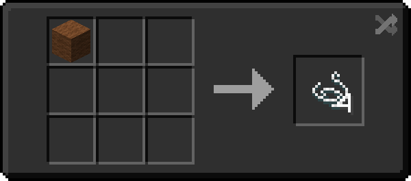
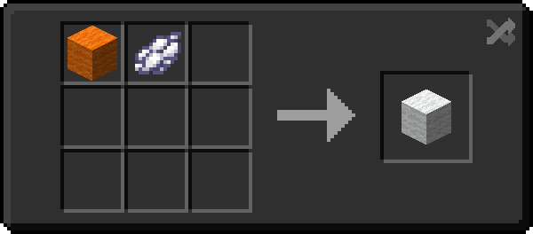
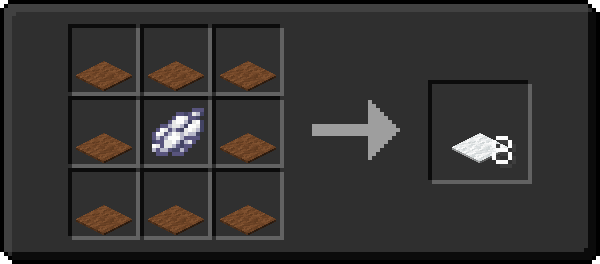
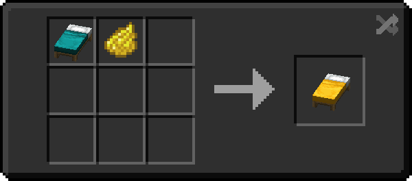

# WoolTweaks-Datapack

| >English README< | [简体中文说明书](./README/README.zho-Hans_CN.md) | [繁體中文說明書](./README/README.zho-Hant_TW.md) |

---

- [WoolTweaks-Datapack](#wooltweaks-datapack)
  - [Gallery](#gallery)
  - [Description](#description)
  - [Icon Source](#icon-source)
  - [About Links](#about-links)

---

## Gallery

> Wool To 4xString  
>   

> Dyed Wool Redyed  
>   

> Dyed Carpet Redyed  
>   

> Dyed Bed Redyed  
>   

---

## Description

Inspiration comes from [Serilum's Wool Tweaks](https://www.curseforge.com/minecraft/mc-mods/wool-tweaks "Wool Tweaks")  

This datapack adds various dyeing recipes for wool and its products, so you can dye the dyed products again.  
Recipes for making wool into thread have also been added.  

**Supported blocks:**
|           TAG           |  Name   |
|-------------------------|---------|
| `wool_tweaks:wt_wool`   | Wools   |
| `wool_tweaks:wt_carpet` | Carpets |
| `wool_tweaks:wt_bed`    | Beds    |

---

## Icon Source

> Thank you **Hexakon#6724** for authorizing the use of  
>   

## About Links

Github: [https://github.com/EvanHsieh0415/WoolTwaeks-Datapack/releases](https://github.com/EvanHsieh0415/WoolTwaeks-Datapack/releases "Github")  
MC MOD: [https://www.mcmod.cn/class/7623.html](https://www.mcmod.cn/class/7623.html "MC MOD")  
CurseForge (unapproved): [https://www.curseforge.com/minecraft/texture-packs/wool-tweaks-datapack-version](https://www.curseforge.com/minecraft/texture-packs/wool-tweaks-datapack-version "CurseForge")  
