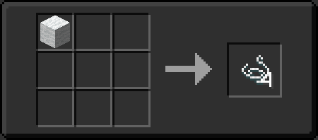
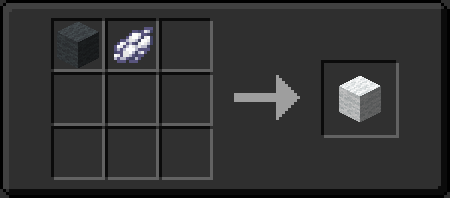
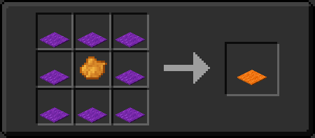
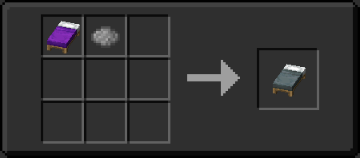

# WoolTwaeks-Datapack

### Inspiration comes from [Serilum's Wool Tweaks](https://www.curseforge.com/minecraft/mc-mods/wool-tweaks "Wool Tweaks")

The recipe of wool is made into a datapack  
靈感來自於[羊毛調整](https://www.curseforge.com/minecraft/mc-mods/wool-tweaks "Wool Tweaks")

Any dye can be used to dye items (wool, beds and carpets) on the workbench or in the synthesis bar on hand.
A synthesis recipe for breaking down wool of any color into 4 threads has also been added.  
任何染料都可以用來為合成染色的物品羊毛（床和地毯）。
還添加了將任何顏色的羊毛分解成 4 根線的配方

### Support: 1.13 - 1.19  

Recipes:  

